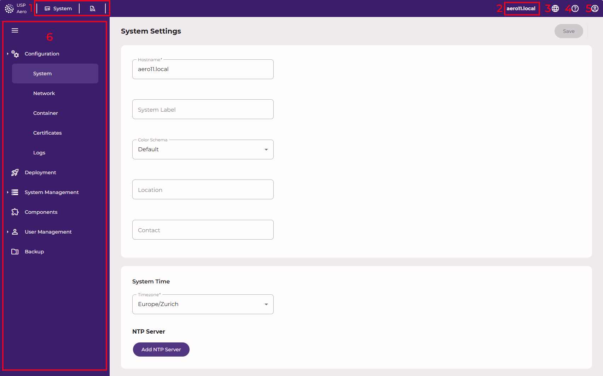
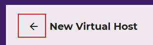

# Management GUI overview

## Top navigation bar

### Module switcher (1)

Lets you switch between the platform shell and any installed feature component (for example WAAP)
without leaving the GUI. Only components that are actually installed on this appliance appear here.

### Context bar (2)

Shows the system name, and below it the system label, so that several appliances can be told apart at
a glance. Both are configured on the [System](../reference/gui/configuration/system) screen.

### Language selector (3)

Switches the language of the GUI.

## Help button (4)

Opens this manual in a new tab, at the page registered for the screen you are currently on.

## User profile menu (5)

The account icon in the top-right corner opens a menu with **User Profile**
(see [User profile and password](../reference/gui/user-management/user-profile)) and **Logout**.

## Main content area

### Side menu (6)

The vertical menu on the left lists the pages of the module currently selected in the module switcher.
Its content changes together with the module switcher.

## Page back button

Appears next to a page's heading whenever that page was opened from another one — for example a
details view opened from a list — and returns you to it.

