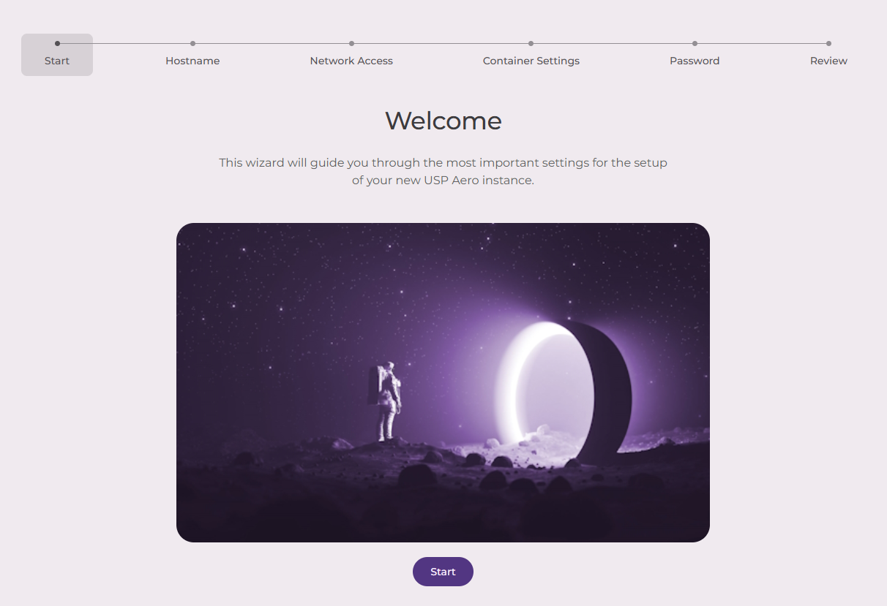
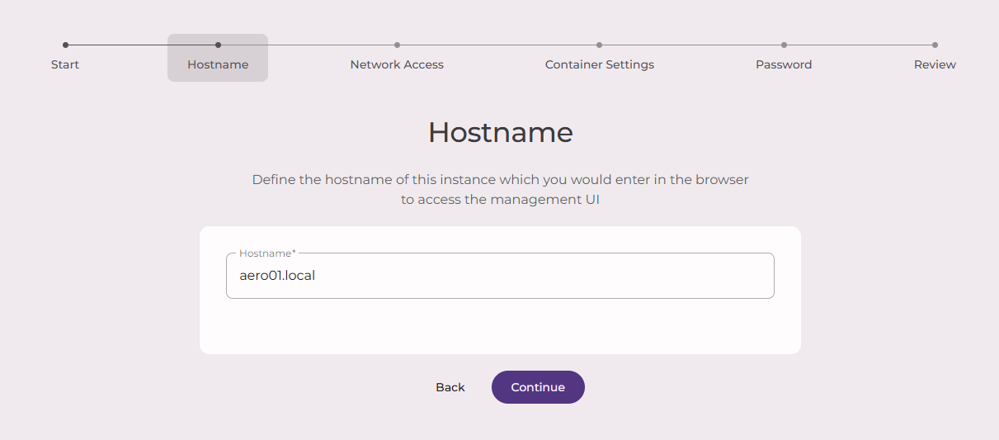
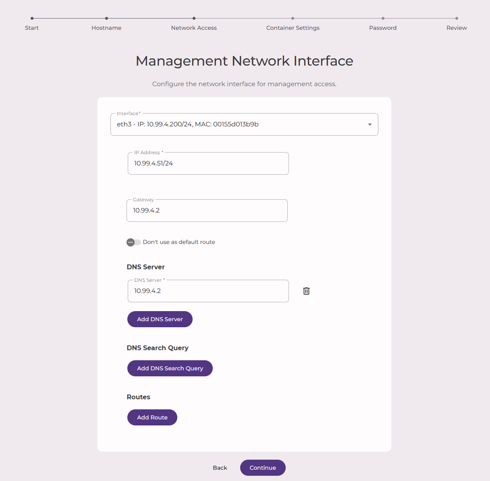
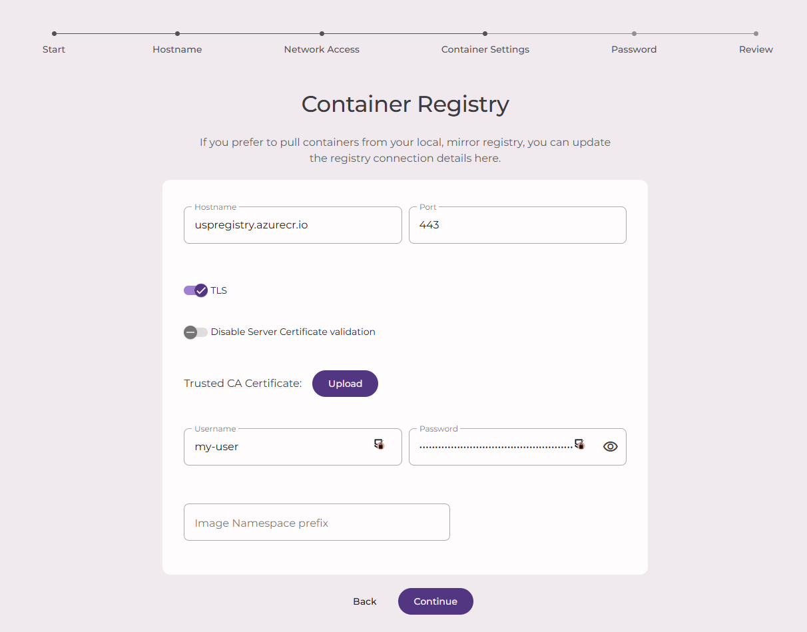
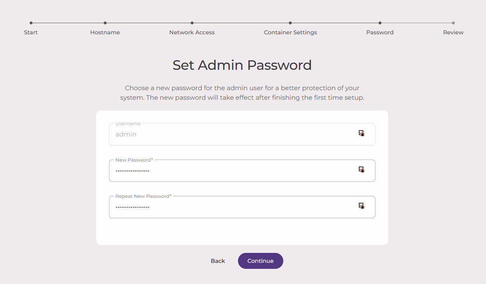
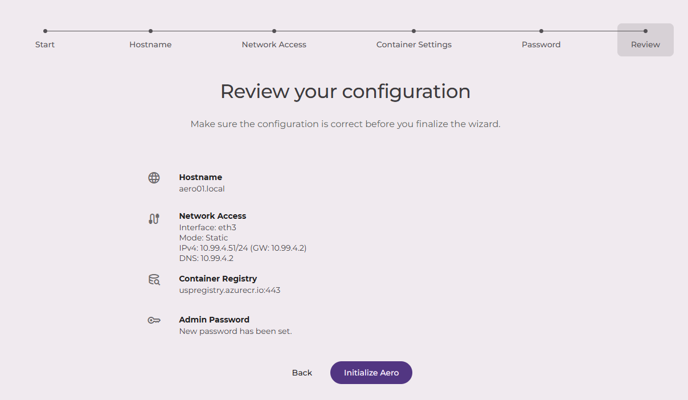

Once the network configuration and bootstrapping have been successfully completed, the first-time setup wizard GUI
becomes available on the configured IP address. The wizard finalized the inital network and container registry 
configuration and sets the password for the `admin` user.

Open a web browser with the given IP address in a https URL:

----
    https://<aero-ip>/
----

This will open the first-time setup wizard UI:

## Configure hostname

Enter the hostname for this system. Besides the IP address this hostname can be used to access the UI:

## Configure Management Network Interface

Configure the management network interface used to access the UI.
Typically it is the one in the drop-down list with the same IP address as used to access the wizard and the values
should already be prefilled:

## Configure Container Settings

Specify the container registry used to pull the container images from. It's possible to use your own mirror registry,
if you have one. If you use the official one from USP ensure that you provide your username and password provided to you:

## Configure Password

In this step, you have to set a password for the "admin" user. 

> [!CAUTION]
> There is no default password and if you lose this password, it's not possible to recover!

You will need this password to log in to the Aero Management GUI with the user "admin" once the first-time setup has been completed.

## Review

As the final step for the first-time wizard, you are asked to review the configuration, and confirm it if everything seems correct.

If so, confirm the settings by clicking the "Initialize Aero" button. The system will apply the configuration which can take up to a few minutes.
Afterward, you can click the link shown, and you will see a login page. The Aero Platform is initialized and ready to be configured further.