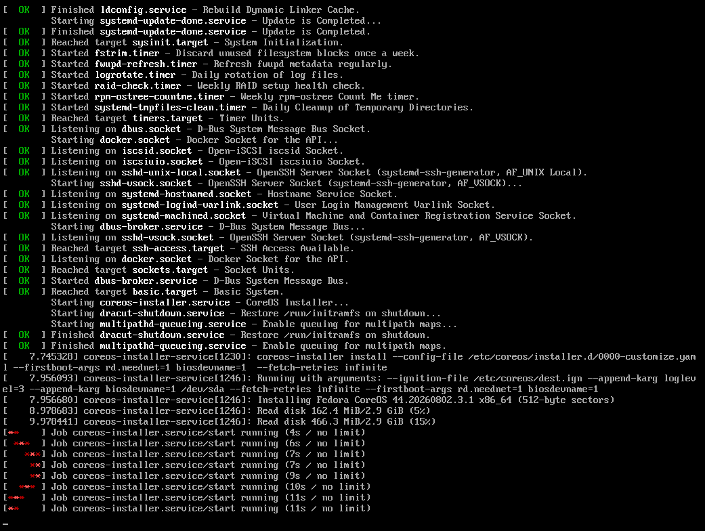
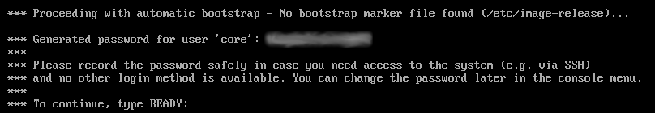
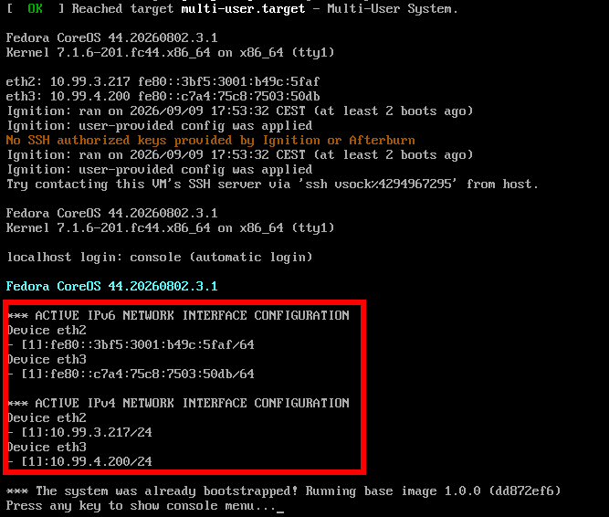
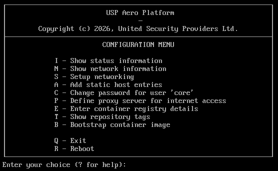
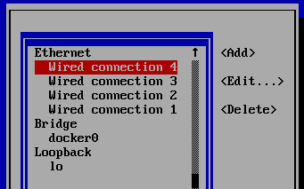

# Installing from ISO

This installation method allows to set up the USP Aero Platform on hardware or virtualized infrastructure. 

## Download ISO image

The first requisite for installing the USP Aero Platform is to download the USP Aero installer iso
from the [USP Service Platform](https://service.united-security-providers.ch/). You will
find the available installing ISO files in the "Products" download section.

## Booting the Installer

If the USP Aero Platform system is set up in an environment with working DHCP and DNS services, the installation
will be very straightforward, otherwise you require to configure the networking during the installation manually:

* Provide the installer ISO-image to the system and boot from it.

* After the initial installation, the console will prompt you a generated password for user `core`.
  Write down the password, as this is your glass-breaking access to the system.

  Type `READY` to continue the bootstrapping.
  

* In the next step, the installer tries to access the USP container registry ("uspregistry.azurecr.io")
  for downloading and automatically installing the USP Aero Base OS image.

  If this is not possible, you have to manually configure the network and
  container registry access - see the next section [Without DHCP / DNS](#without-dhcp--dns). 
* After a reboot, the [first-time setup wizard](firsttimewizard) UI will become available on all network interfaces.

> [!TIP]
> The IP address(es) where the UI is available after initial installation will be shown in the console window:

## Without DHCP / DNS

If DNS and DHCP are not available (or not working correctly) in the installation environment, the system
will not be able to automatically download the USP Aero Base image after the initial installation.
In this case, it is necessary to manually configure the network settings through the console menu and
trigger the bootstrapping process of the USP base platform:

* After the failed attempt to download the USP Aero base image, the [console menu](../reference/console.md) will be shown

  

* Configure the network interfaces.
  In the console menu type `S`:
  * Select `Edit a connection`
  * Select the correct `Ethernet`connection according to the MAC address e.g. `Wired connection 1`

    

  * In `IPv4 CONFIGURATION` select `<Manual>` and open the configuration dialog by selecting `Show`
  * Addresses select `<Add...>` and enter the static IP address in CIDR notation
  * Gateway: set default gateways IP address
  * DNS servers: add nameserver IP address and optionally search-domains
  * Select `OK` to save settings
  * Select `Back` and then `Quit` to leave the Network Manager TUI.
* Validate if the container registry is accessible:
  * Type `T`
  * It should show a list of container tags, including the tag you have selected. Otherwise, the connection to the
    registry is not properly set up. Recheck the network and registry settings. If you require to use a proxy container
    registry, you can configure it by typing `E`.
* Bootstrap the USP Aero Base OS image:
  * Type `B` and confirm with `y`

The system will reboot automatically. Afterward, the [first-time setup wizard](firsttimewizard)  UI will become
available on all configured network interfaces.
