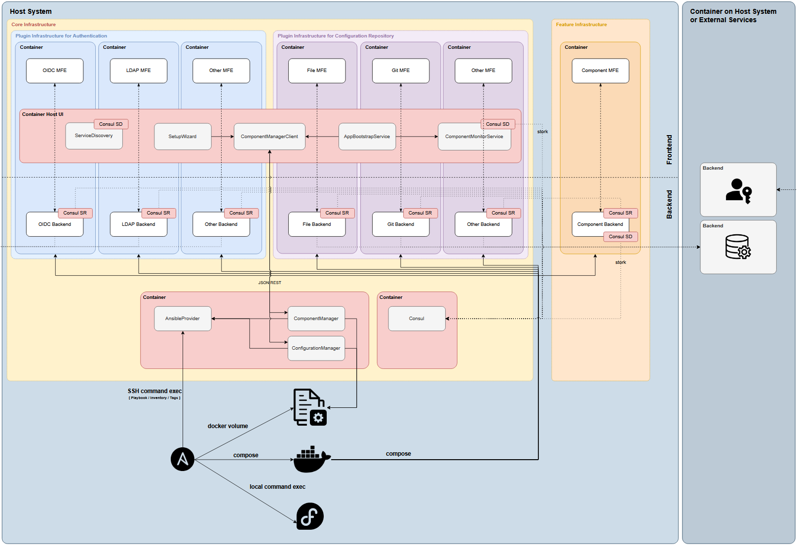

> For AI agents: this documentation is indexed at https://docs.united-security-providers.ch/usp-aero/llms.txt, and every page is available as markdown at its own address plus index.md.

# USP Aero Platform

The USP Aero Platform is based on Fedora CoreOS and provides a flexible, extensible container-based environment for
running several security-related components and services.

It allows to install different versions / releases of different security components as the need arises,
independent of which release was originally installed.

* Ease-of-use: The platform allows an easy setup and regular (automated) updates to ensure a low cost of operations but also ensures to keep up to date with software components and allows to fix vulnerabilities in an efficient and timely manner.
* Ease-of-Integration: Todays security components must be integrated in the overall IT system, like IDM, SIEM, etc.
  Therefore, the Aero Platform allows for easy integration with systems like AD/LDAP or OIDC OP for management access,
  SIEM for Log analysis, Prometheus etc. for monitoring.
* Versatility and extensibility: The Aero platform can be seamlessly extended with several component (WAAP reverse proxy, WAAP Authenticate, ***TODO*** ) and future component that will provide new functionality.

## Pages

- [Aero Platform Release Notes](https://docs.united-security-providers.ch/usp-aero/platform/latest/aero-platform-releasenotes/index.md)
- [Installation](https://docs.united-security-providers.ch/usp-aero/platform/latest/install/overview/index.md)
- [Requirements](https://docs.united-security-providers.ch/usp-aero/platform/latest/install/requirements/index.md)
- [Download](https://docs.united-security-providers.ch/usp-aero/platform/latest/install/download/index.md)
- [Setup](https://docs.united-security-providers.ch/usp-aero/platform/latest/install/installation/index.md)
- [Console menu](https://docs.united-security-providers.ch/usp-aero/platform/latest/install/console/index.md)
- [First-time setup wizard](https://docs.united-security-providers.ch/usp-aero/platform/latest/install/firsttimewizard/index.md)
